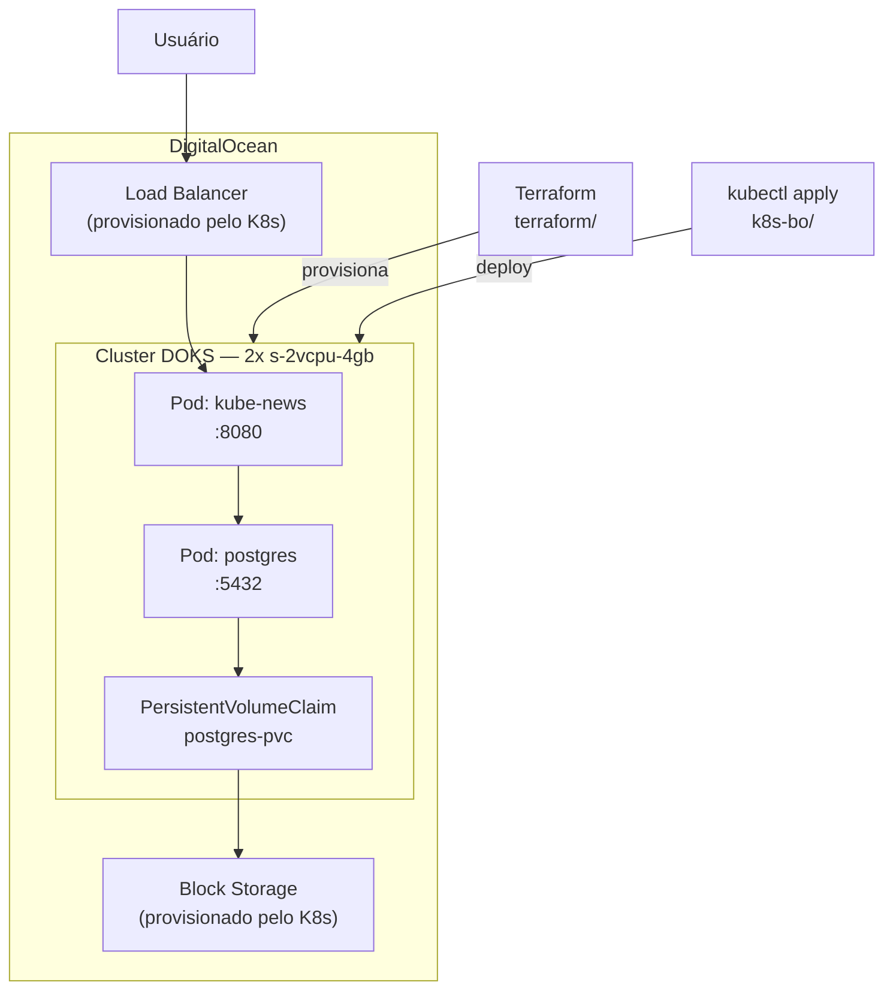

# Infraestrutura DOKS para kube-news na DigitalOcean

## Contexto

A aplicação `kube-news` roda hoje apenas localmente (Docker Compose ou cluster
local). O evento **Claude Code para DevOps** exige demonstração da app num
ambiente real de cloud, expondo comportamentos que só aparecem em provedor real:
LoadBalancer provisionado automaticamente, PVC com Block Storage, probes em nós
reais.

## Problema

Sem infraestrutura em cloud, não é possível demonstrar comportamento real do
Kubernetes durante o evento — LoadBalancer, PVC com Block Storage, liveness e
readiness probes em nós reais. O escopo se limita ao ambiente local, que não
evidencia a integração entre K8s e o provedor de cloud.

## Solução proposta

Criar um projeto Terraform em `terraform/` no repositório atual, usando o
provider da DigitalOcean, que provisiona:

- Cluster DOKS com node pool `s-2vcpu-4gb`, 2 nós
- Output do kubeconfig para acesso via `kubectl`

O Terraform cuida exclusivamente da infraestrutura. Os manifests existentes em
`k8s-bo/` permanecem sem alteração e são aplicados via `kubectl apply` após o
cluster estar disponível. LoadBalancer e Block Storage são provisionados
automaticamente pela integração DOKS ao aplicar os manifests.

## Alternativas

- **VMs (Droplets)** — descartada. Exigiria instalação e configuração manual
  do K8s (kubeadm), complexidade operacional sem ganho didático para o evento.
- **Outros provedores (GKE, EKS, AKS)** — descartados. DigitalOcean escolhida
  por custo mais acessível e simplicidade do provider Terraform.

## Riscos

| Risco | Mitigação | Sinal de alerta |
|---|---|---|
| Limite de quota na conta DO | Verificar quota de vCPUs/Droplets antes do apply | `terraform apply` falha com erro de quota |
| Block Storage indisponível na região | Confirmar disponibilidade em `nyc1` antes do apply | PVC fica em `Pending` após `kubectl apply` |
| Kubeconfig expira | Regenerar via `doctl kubernetes cluster kubeconfig save` | `kubectl get pods` retorna erro de autenticação |
| Custo acumulado após o evento | Executar `terraform destroy` ao finalizar | — |

Critério de sucesso pós-deploy: pods `kube-news` e `postgres` em `Running`,
PVC em `Bound`, LoadBalancer com IP externo atribuído, endpoints `/health` e
`/ready` respondendo HTTP 200.
